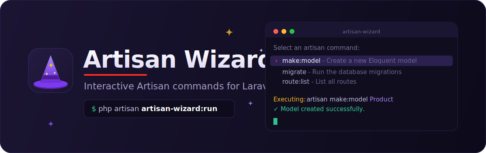

<p align="center">
  
</p>

# Artisan Wizard — interactive Artisan commands for Laravel

[](https://packagist.org/packages/meego47/artisan-wizard)
[](https://github.com/meego47/artisan-wizard/actions?query=workflow%3Arun-tests+branch%3Amain)
[](https://github.com/meego47/artisan-wizard/actions?query=workflow%3A"Fix+PHP+code+style+issues"+branch%3Amain)
[](https://packagist.org/packages/meego47/artisan-wizard)

Artisan Wizard turns `php artisan` into a guided, interactive menu. Instead of
remembering a command's exact name and the spelling of every argument and option,
you run a single command and let the wizard walk you through it: pick a command
from a list, fill in its arguments and options step by step, preview the exact
call, and run it — all without leaving your terminal.

It's built on [Laravel Prompts](https://laravel.com/docs/prompts) and reads every
command straight from Artisan's own definitions, so any command registered in your
app — first‑party, framework, or third‑party package — shows up automatically.

## Why use it

- **Stop memorising commands and flags.** Every registered command, its
  description, arguments, and options are presented to you.
- **Never run a half‑filled command.** Required arguments and options are marked
  `[Required]`, and the *Run* action only appears once they're all provided.
- **See before you run.** The wizard prints the exact `artisan …` line it's about
  to execute, then shows the command's output and its exit code.
- **Great for onboarding.** New team members can discover what a project's
  commands do without digging through code.

## Features

- Browse every registered Artisan command, sorted alphabetically with descriptions.
- Fill arguments and options one at a time, with a running summary of what you've set.
- Full support for the input types Artisan defines:
  - required and optional arguments,
  - value options (`--queue=high`),
  - boolean flags (`--force`),
  - array / variadic arguments and options (add several values).
- Required‑field gating — *Run* is hidden until every required field has a value.
- A live preview of the command, e.g. `artisan migrate --force --ansi`.
- Run as many commands as you like in one session, with **Back** and **Exit** navigation.

## Requirements

- PHP 8.2+
- Laravel 10, 11, 12, or 13

## Installation

Install the package via Composer:

```bash
composer require meego47/artisan-wizard
```

The service provider is auto‑discovered, so there's nothing else to wire up.

Optionally publish the (currently empty) config file:

```bash
php artisan vendor:publish --tag="artisan-wizard-config"
```

## Usage

Start the wizard:

```bash
php artisan artisan-wizard:run
```

A typical session looks like this:

```text
 ┌ Select an artisan command to execute: ──────────────────────┐
 │   make:controller - Create a new controller class           │
 │ › make:model - Create a new Eloquent model class            │
 │   make:migration - Create a new migration file              │
 │   …                                                         │
 │   Exit the wizard                                           │
 └─────────────────────────────────────────────────────────────┘

Filled fields:
  (None yet)

 ┌ Select a field to fill (or run the command): ───────────────┐
 │ › [Required] Fill argument: name - The name of the model    │
 │   Append option: migration - Create a new migration file    │
 │   Append option: factory - Create a new factory             │
 │   Back to command selection                                 │
 └─────────────────────────────────────────────────────────────┘

# → choose the argument and type "Product"
# → append --migration and --factory
# → once "name" is filled, "Run command with current settings" appears

Executing: artisan make:model Product --migration --factory --ansi

   INFO  Model [app/Models/Product.php] created successfully.
   INFO  Migration [database/migrations/..._create_products_table.php] created successfully.

Command executed successfully!
```

While configuring a command:

- **Pick a field** to fill from the menu. Arguments and value options prompt you
  for input; boolean flags are appended with a single selection. Array fields stay
  in the menu so you can add multiple values.
- **Run command with current settings** appears as soon as all required fields are
  filled; it runs the command, prints its output, and reports the exit code.
- **Back to command selection** returns you to the command list without running.
- **Exit the wizard** leaves the session.

## Testing

```bash
composer test
```

Static analysis and code style:

```bash
composer analyse   # PHPStan / Larastan
composer format    # Laravel Pint
```

## Changelog

Please see [CHANGELOG](CHANGELOG.md) for more information on what has changed recently.

## Contributing

Please see [CONTRIBUTING](CONTRIBUTING.md) for details.

## Security Vulnerabilities

Please review [our security policy](../../security/policy) on how to report security vulnerabilities.

## Credits

- [Ruslan Mironcenco](https://github.com/meego47)
- [All Contributors](../../contributors)

## License

The MIT License (MIT). Please see [License File](LICENSE.md) for more information.
